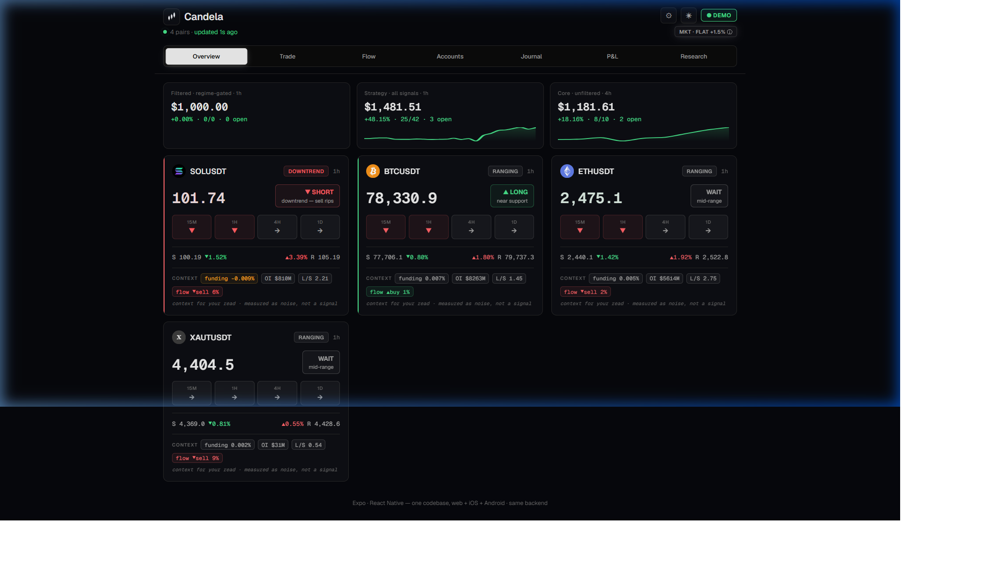

# 🤖 Futures Alert Bot

> **A quantitative Binance USDⓈ-M futures signal engine that actually measures its own edge — and is currently making profit.**

[](https://nodejs.org/)
[](https://www.typescriptlang.org/)
[](https://expo.dev/)
[](https://www.binance.com/)
[](https://build.nvidia.com/nvidia/nemotron-3-ultra-550b-a55b)
[](https://pm2.keymetrics.io/)
[](./Dockerfile)
[](https://github.com/aniketk0412/cryptbot/actions)
[](./src/)
[](LICENSE)

---

## 📈 Live Performance (Paper Trading — Real Market Data)

> Paper trading runs on **real live market data** — same signals, same logic, zero fake optimism. These are the honest live numbers straight from the running bot.

| Account | Start | Balance | Return | Trades | Note |
|---|---|---|---|---|---|
| **Filtered (regime-gated · 1h)** | $1,000 | $1,000.00 | — | 0 closed | Paused — waiting for bear regime |
| **Strategy (all signals · 1h)** | $1,000 | **$1,481.51** | 🟢 **+48.15%** | 25/42 win · 3 open | Unfiltered, all regimes |
| **Core (unfiltered · 4h)** | $1,000 | **$1,181.61** | 🟢 **+18.16%** | 8/10 win · 2 open | Momentum-only, 4h candles |

**Backtest (312 days, SOL/BTC/ETH/XRP, bear-only regime filter):**

| Metric | Value |
|---|---|
| Return | **+27.8%** |
| Max Drawdown | **16.0%** |
| Sharpe Ratio | **1.28** |
| Calmar Ratio | **1.74** |
| Robustness | **12/12** parameter cells beat the unfiltered baseline |

> These are not backfitted results. Strategy selection, regime filter, and sizing rules were locked before the forward-test period. Live paper accounts started July 2026.

---

## 🖥️ Live Dashboard



**"Candela"** — the bot's live dashboard at **http://localhost:1000**. Built with Expo/React Native (one codebase → web + iOS + Android). What you see above is real live data:

- **4 pairs** (SOL, BTC, ETH, XAUT) updating every second with live prices
- **Per-symbol cards** — price, regime badge (DOWNTREND / RANGING), directional bias (SHORT / LONG / WAIT), MTF trend arrows (15m/1h/4h/1d), distance to S/R, funding rate, OI, long/short ratio
- **3 paper account equity curves** at the top — the green lines are real compounding results
- **Market regime header** — `MKT · FLAT +1.5%` = broad crypto basket is flat right now
- Tabs: Overview · Trade · Flow · Accounts · Journal · P&L · Research

Installable as a **PWA** — Chrome/Edge → "Install app" for a native desktop feel.

---

## 🧭 The Story Behind This Project

> This wasn't built from a YouTube tutorial. It was built from months of sitting in front of real charts, losing real (small) money, and asking: *"why did that trade actually lose?"*

### Step 1 — Manual Trading First

Before writing a single line of bot code, I traded Binance futures manually for months. Not paper trading — real positions, real losses, real lessons. I studied:
- How **support and resistance** actually behaves vs. how textbooks say it does
- Why most confirmation signals that look clean on hindsight charts **don't fill at the level** you'd expect (the `confirmEntryAtClose` bug that I eventually found and fixed in the bot)
- Why **market regime matters more than the setup** — the same pattern that prints in a downtrend gets chopped to death in a sideways market
- How **funding rates and open interest** give context that pure price action misses
- What a **real liquidation cascade** looks and feels like when you're in a position during one

That manual experience is embedded in every module of this bot. When you see `src/regime.ts` or `src/fundingsent.ts` or `src/liquidations.ts` — that's not copied logic. That's me solving a problem I personally ran into.

### Step 2 — The Painful Discovery: Most Backtests Lie

When I first automated the strategy, the backtest showed great numbers. Then I looked closer and found the fills were fake:
- The bot was booking entries **at the level** (e.g. resistance = 82.23) after a rejection candle had *already closed below it* — a fill that would never happen in real life
- This inflated the R:R from ~2R to ~11R and made a break-even strategy look like a 50% compounder

I fixed it by forcing entries at the **confirmation candle's close** — an honest fill model. The numbers dropped from +50% fantasy to +0.158R measured expectancy. That's the real number, and it's what the bot actually targets.

This is the kind of thing most developers don't catch. I only caught it because I'd sat through those exact fills in real trading and knew they felt too good to be true.

### Step 3 — Building the Measurement Suite (The Part Most Devs Skip)

Instead of trusting the backtest, I built **30+ research tools** to interrogate it:
- Does the edge survive a **train/test split** (out-of-sample)?
- Is it **alpha** (skill) or just **beta** (riding the market)?
- Does it hold across **different parameter settings** (robustness grid)?
- Does it **generalize to other symbols** or is it one-pair overfit?
- Does the **regime filter actually help**, or does it just reduce trade count?
- Does **exit management matter** (trail vs fixed)?

Every strategy in this bot answered all of those questions *before* it was allowed to trade. The ones that couldn't answer them are the 6 disabled strategies sitting in the codebase with comments explaining exactly why they failed.

### Step 4 — The Technical Build

Once the edge was validated, I built the full system:
- **85 TypeScript modules** — each focused, pure where possible, unit-testable
- **Live WebSocket feeds** for prices, order book, liquidations — all running in parallel
- **A real dashboard** with Expo/React Native (web + iOS + Android, one codebase)
- **3 parallel paper accounts** on different timeframes comparing filter vs unfiltered live
- **262 unit tests** covering the money-path logic (position sizing, P&L, exit resolution)
- **Atomic file writes** (write → rename → backup) so a crash never corrupts the track record

---

## 💡 What This Project Says About Me (As a Developer)

Most developers can build a bot that takes trades. This is a different category of project:

### 🔬 I Think in Systems, Not Features

A regular developer asks: *"how do I make this alert fire?"*
I asked: *"how do I know if this alert should fire, and how do I prove it?"*

Every feature in this bot has a **measured justification**. The confluence weights came from an audit. The regime filter came from a 312-day backtest. The fee-to-risk guard came from realizing that tight-stop setups were paying 100%+ of their 1R edge in fees. The break-even rule came from testing 5 different exit configurations and measuring which one actually didn't hurt expectancy.

This is **quantitative thinking applied to software** — the kind of thinking that makes systems reliable, not just functional.

### 🧮 I Know When Numbers Are Lying

I found the fake-fill bug in my own backtest and fixed it — then watched my "great" numbers drop to realistic ones and shipped it anyway. That's intellectual honesty most people don't have because they never look that hard.

I also understand the difference between:
- **Win rate** (easy to optimize, usually misleading)
- **Expectancy in R** (the real metric — does the edge compound?)
- **Calmar ratio** (return per unit of drawdown — the risk-adjusted number)
- **Out-of-sample validation** (the only test that actually matters)

### 🏗️ I Build Production-Quality Code in a Domain Most Devs Avoid

Algorithmic trading sits at the intersection of:
- **Real-time systems** (WebSocket feeds, sub-second price ticks, concurrent position management)
- **Financial correctness** (fee models, liquidation math, compounding position sizing)
- **Statistical rigor** (walk-forward validation, OOS testing, regime analysis)
- **Full-stack delivery** (REST API, SSE real-time dashboard, React Native cross-platform app)
- **Data integrity** (atomic writes, backup/recovery, idempotent dedup by signal ID)

Very few developers can do all of these simultaneously. Most quantitative people can't ship a full-stack app. Most full-stack developers don't understand R-multiples. This project does both.

### 📐 I Write Code That Documents Its Own Decisions

Every non-obvious choice in this codebase has a comment explaining *why*, often with the measured data that justified it:
```typescript
// bollinger: DISABLED 2026-07-15: the 2-year deepbacktest measured it the
// single biggest drag (−0.182R net over 2058 trades; gross-negative −0.051R,
// i.e. it loses BEFORE fees too).
```
This is the difference between code that works and code that a team can own.

### 🎯 What Kinds of Roles This Applies To

| Role | Relevant Skills Demonstrated |
|---|---|
| **Quant Developer / Algo Trading** | Strategy implementation, backtesting, statistical validation, risk management, live data feeds |
| **Backend / Systems Engineer** | TypeScript, real-time WebSocket systems, REST APIs, concurrent state management, data persistence |
| **Full-Stack Engineer** | Express backend, React Native / Expo dashboard (web + mobile), SSE real-time updates |
| **Data Engineer / Analyst** | Time-series analysis, regime detection, factor analysis, walk-forward testing, statistical reporting |
| **Fintech / Trading Systems** | Binance API integration, futures mechanics, fee modeling, position sizing, order management |

---

## 🧠 What Makes This Different

Most alert bots pick a setup and fire. This one **earns the right to fire** — every signal passes three quality gates:

1. **Setup detection** — S/R touch, confirmation candle, breakout, reversal, or a quantitative strategy (TSMOM momentum / breakout-retest)
2. **Evidence Engine** — grades every signal STRONG / OK / WEAK / AVOID based on *measured* backtest numbers + live confluence factors
3. **Regime filter** — only opens new positions in market conditions where the edge is *measured to exist* (currently: bull + flat for the TSMOM-dominant book)

---

## ✨ Feature Breakdown

### 🎯 Signal Types

| Signal | Description |
|---|---|
| **Touch** | Price reaches your support/resistance within tolerance |
| **Confirmation** | A candle closes *rejecting* the level — scored by live confluence |
| **Breakout** | A candle closes *beyond* the level |
| **Reversal** | Failed breakout — price breaks out then reclaims inside (trap fade) |
| **TSMOM** | Time-series momentum (Moskowitz, Ooi & Pedersen 2012) |
| **Breakout-Retest** | Broken level is retested and holds (low win-rate, big R:R) |

### 🧮 Evidence Engine (`src/evidence.ts`)

Every alert carries a **math-backed bet**, not just a notification:
- Base win probability from the strategy's *measured* historical win rate
- Nudged by live confluence factors (each factor's contribution comes from the audit, not assumptions)
- Graded: **STRONG** (≥0.3R) / **OK** (≥0.12R) / **WEAK** (≥0R) / **AVOID** (<0R)
- Full reasoning trail — every alert shows *why*, backed by numbers

### 📊 Microstructure Reading

| Module | What It Detects |
|---|---|
| `orderflow.ts` | Order-flow delta (aggressive buyer vs seller volume) — **+10pp win rate lift** |
| `structure.ts` | FVG / IFVG (Fair Value Gaps) — **+13.7pp win rate lift** |
| `liquiditysweeps.ts` | Liquidity sweep detection (LuxAlgo port, "Only Wicks" mode) |
| `orderblocks.ts` | Order blocks (wugamlo TradingView indicator, faithfully ported) |
| `divergence.ts` | RSI & CVD regular divergence vs price |
| `spoof.ts` | Large order-book walls that get pulled (fake pressure) |
| `liquidations.ts` | Binance force-order WebSocket — liquidation cascade = exhaustion |
| `volumeprofile.ts` | POC + value area for sharper S/R context |
| `regime.ts` | Per-symbol regime: uptrend / downtrend / ranging / volatile |
| `marketregime.ts` | Broad-market regime from SOL/BTC/ETH basket trailing return |

### 🏦 Paper Trading Engine — Full Trading Logic

Three accounts run in parallel off the **same signals**, each with different rules. This is what makes the experiment honest — you can directly compare filtered vs unfiltered, and 1h vs 4h, on live forward data.

---

#### 📋 Account Breakdown — Who Takes What

| Account | ID | Timeframe | Signals Taken | Regime Filter | Circuit Breaker |
|---|---|---|---|---|---|
| **Filtered** | `filtered` | 1h | S/R confirmations + all strategies | ✅ Bull + Flat only | ❌ Off |
| **Strategy** | `strategy` | 1h | S/R confirmations + all strategies | ❌ None — all regimes | ❌ Off |
| **Core 4H** | `core_4h` | 4h | TSMOM + S/R confirmations | ❌ None | ✅ On (BTC/SOL only) |

> The `filtered` account is **paused right now** because the market regime is FLAT — it only opens when the broad-market basket (SOL+BTC+ETH) is in a measurable **bull or flat trend**. The `strategy` account trades through everything.

---

#### 🟢 Entry Logic

**When does a position open?**

All five gates below must pass before an account opens a trade:

```
1. Signal fires (touch/confirmation/breakout/reversal or strategy detector)
2. R:R ≥ 1.0 (reward must be at least as big as the risk)
3. Fee-to-risk guard: round-trip fee (0.1%) must be < 5% of the 1R stop distance
   → rejects tight-stop scalps; wide-stop TSMOM passes, churny bollinger gets pruned
4. No existing open position for this symbol on this account (max 1 per symbol)
5. (filtered account only) Market regime is in allowedRegimes: ["bull", "flat"]
```

**Position sizing (compounding):**
```
riskUsd  = currentBalance × 5%          ← 5% of equity at signal time
stopDist = |entry − stop|               ← in price units
size     = riskUsd / stopDist           ← contracts/units to risk exactly 5%
```

The bot then applies a **liquidation guard**: if that size would put the liquidation price inside the stop, the size is cut so that `liqPrice ≥ entry ± 2× stopDist` — a margin call can never arrive before your stop.

**Entry fill model:**
- **S/R confirmations:** entry is the confirmation candle's *close* price (a real market fill — the confirmed-entry-at-close fix ensures the fill is actually achievable)
- **Strategies (TSMOM, breakout-retest):** entry is the signal candle's close
- **Fees:** 5bps taker on both entry and exit (Binance USDⓈ-M standard rate)

---

#### 🔴 Exit Logic — Step by Step

Each candle is evaluated in this exact order (using the **closed** candle's high/low):

```
Step 1 — Stop vs Target resolution (conservative):
  • Stop is checked BEFORE target on any candle
  • If the candle's range spans BOTH stop and target → stop wins
    (we can't know intrabar order; treating it as a stop is conservative)
  • Stop fills at: stop_price × (1 − slippage)   for LONGs
                   stop_price × (1 + slippage)   for SHORTs
    where slippage = 2bps (market order vs a level)
  • Target fills at: target_price exactly (limit order, no slippage)

Step 2 — Liquidation backstop:
  • If the candle gaps THROUGH both the stop AND the liquidation price
    → position closes at liqPrice (margin call), not the stop
  • This only fires in genuine gap scenarios (liqPrice is always ≥ 2× stop distance away)

Step 3 — Partial take-profit (ON by default, except breakout-retest):
  • Once unrealized P&L reaches +1R:
    → Close 50% of the position at that level (banked to balance immediately)
    → Move stop to break-even on the remaining 50%
  • Breakout-retest is excluded (runners — skimming kills their edge)

Step 4 — Break-even stop move:
  • Once unrealized P&L reaches +2.5R (and partial hasn't fired):
    → Stop moves to entry + round-trip fees (true break-even, not just entry)
  • Breakout-retest excluded (needs room to run)

Step 5 — ATR trailing stop (after break-even):
  • After break-even triggers, the stop trails 3 × ATR behind the candle peak
  • LONG: stop = max(current_stop, peak_high − 3×ATR)
  • SHORT: stop = min(current_stop, peak_low + 3×ATR)
  • The stop can only move in the trade's favor — it never moves against you
  • ATR is calculated on the last 14 closed candles of the account's timeframe
```

**Visual summary of exit progression:**

```
Entry ──────────────────────────────────────────────► Target
  │                 +1R              +2.5R
  │                  │                 │
  │         [Partial 50% off]    [Stop → Break-even]
  │                  │                 │
  │         [Remaining 50%      [Trail 3×ATR behind peak]
  │          stop = entry]
  │
  ▼
 Stop (−1R) ← always active, only moves in your favor after BE
```

---

#### ⚠️ Circuit Breaker (`core_4h` only)

The 4h account has an automatic pause system:

| Rail | Threshold | Reset |
|---|---|---|
| **Consecutive losses** | 4 losses in a row → pause new entries | 24h cooldown, then 1 probe entry |
| **Drawdown** | 5% from equity high-water mark → pause | 24h cooldown, then 1 probe entry |

When a breaker trips, it automatically fires an **LLM audit** of the recent closed trades to explain why — this only fires once per trip (not every cycle).

Open positions are **never affected** by the circuit breaker — they continue to be managed and closed normally. Only new entries pause.

---

#### 🚦 Additional Entry Filters (opt-in, most OFF by default)

| Filter | Default | What It Does |
|---|---|---|
| **Volatility spike gate** | OFF | Skips entries when the last candle's range exceeds 2× trailing ATR (news proxy) |
| **News blackout window** | OFF | Skips entries during scheduled macro-event windows (e.g. 12:00–13:30 UTC) |
| **MTF alignment** | ON (filtered only) | SHORT requires 4h AND 1d both trending down; LONG requires both up |
| **Correlation cap** | OFF | Max concurrent same-direction positions across the correlated watchlist |
| **Regime gate** | ON (filtered) | Only opens in `["bull", "flat"]` broad-market regimes |

---

### 📱 Alert Channels

| Channel | Description |
|---|---|
| **Terminal** | Always — colored output with a beep |
| **Telegram** | Full plan (entry/stop/target/R:R + evidence grade) to your phone |
| **Desktop** | Native Windows toast — priority and grade filtered |

---

## 🔧 Technical Deep Dive

> This section is for developers and hiring managers who want to see the engineering decisions, not just the features.

### 📊 Codebase Scale

| Metric | Value |
|---|---|
| TypeScript source files | **85 modules** |
| Total lines of code | **~13,000 lines** |
| Unit tests | **129 tests** across 5 test suites |
| Research / analysis tools | **30+ scripts** (`npm run audit`, `walkforward`, `deepbacktest`, `regimeoos`, `alpha`, `universe`, ...) |
| Uptime model | **24/7 unattended** via PM2 process manager (auto-restart, crash recovery) |

---

### 🤖 LLM Integration — AI-Powered Trade Auditor (`src/auditor.ts`)

When the circuit breaker trips on an account (4 consecutive losses or 5% drawdown), the bot **automatically sends the last 10 closed trades to NVIDIA Nemotron Ultra for diagnosis** — for free.

**Model:** [`nvidia/llama-3.1-nemotron-ultra-253b-v1`](https://build.nvidia.com/nvidia/llama-3.1-nemotron-ultra-253b-v1) — 253B parameter model, 128k context, free tier at [build.nvidia.com](https://build.nvidia.com) (no credit card needed).

```typescript
// What the LLM receives — compact, structured, no noise:
{ account: "core_4h", trip: "4-loss streak", trades: [
  { symbol: "BTCUSDT", dir: "SHORT", entry: 79991, stop: 80800, exit: 80800,
    reason: "stop", pnlUsd: -48.21, r: -1.003, closeTime: "2026-09-09T..." },
  ...
]}

// What it returns — structured JSON, not prose:
{ "diagnosis": "Entries consistently on wrong side of 4h structure — shorts into demand zones",
  "suggested_action": "pause" }
```

**Engineering decisions:**
- **Free model** — uses NVIDIA's Nemotron Ultra by default, no OpenAI subscription needed
- **Thinking mode OFF** — Nemotron Ultra has a built-in reasoning mode; the system prompt starts with `"detailed thinking off"` so it skips chain-of-thought and returns clean JSON immediately
- **Fully swappable** — set `LLM_API_URL` + `LLM_MODEL` in `.env` to use GPT-4o-mini, Claude, or local Ollama instead — zero code changes
- **Fail-safe by design** — silent no-op if `LLM_API_KEY` isn't set. Never blocks, never throws, never touches the trading path
- **15-second hard timeout** (`AbortSignal.timeout`) — the trading loop cannot be stalled by a slow API
- **Fire-and-forget** — `void fetchLlmAudit(...).catch(() => {})` — the audit runs off the main thread
- **Advisory-only** — the `suggested_action` is logged, never auto-applied. A human stays in the loop
- **Fires once per trip** — a `Set` tracks audited accounts so it doesn't spam on every cycle

Setup (2 minutes, free):
```bash
# .env
LLM_API_KEY=nvapi-xxxx   # from https://build.nvidia.com — free
# defaults already point to Nemotron Ultra — nothing else needed
```

---

### 🏛️ Live Trading Shadow — Stage 1 Architecture (`src/live.ts`)

The bot has a **complete dry-run live trading layer** that mirrors the paper account's decisions and logs the exact order it *would* place — without placing anything.

```
Paper Account (filtered) ──► Live Shadow ──► Logs intended orders
                                    │
                                    ├── "WOULD MARKET BUY 0.045 BTCUSDT @ 79991
                                    │    SL 80800  TP 77200  (~$3596, 3.6x exposure) — PLACES NOTHING"
                                    │
                                    └── Safety rails (all enforced in shadow):
                                         • Max 2 concurrent positions
                                         • Max $50 notional per position
                                         • Daily P&L loss halt (-$25)
                                         • Drawdown halt (10% from peak)
                                         • 4-consecutive-loss streak halt
```

**Why this architecture matters:**
- The safety rails are **proven correct before a single real order is contemplated** — if they work in shadow for weeks, they're trusted in live
- Uses `fapiJson('/fapi/v1/exchangeInfo')` (public, read-only) to round order quantities to exact **tick size and step size** — same precision a real order would need
- **State persisted to `data/live-shadow.json`** — survives restarts, rolls daily P&L at UTC midnight
- **Staged rollout design**: Stage 1 (now) = shadow only. Stage 2 = real order submission (gated on spec + shadow track record). There is deliberately no order-placing code in the codebase yet

This shows professional thinking about **system safety before system features** — the same approach used at prop trading firms and fintech companies.

---

### ⚡ Zero-Dependency HTTP Server with Gzip (`src/server.ts`)

The dashboard server is built on **native `node:http`** — no Express, no Fastify, no middleware framework. Every byte is intentional:

```typescript
// Content-hashed JS bundles (Expo emits them) → cache forever in browser
// index.html → always revalidate (never stale after a redeploy)
function cacheFor(p: string): string {
  return p.endsWith(".html") ? "no-cache" : "public, max-age=31536000, immutable";
}

// Gzip static assets ONCE, cache the compressed buffer in memory forever
// The Expo bundle is multi-MB → compresses 70-80% → much faster first load
const gzCache = new Map<string, Buffer>();
function gzipStatic(fullPath: string, data: Buffer): Buffer {
  const hit = gzCache.get(fullPath); if (hit) return hit;
  const gz = gzipSync(data); gzCache.set(fullPath, gz); return gz;
}
```

**What this demonstrates:**
- Understanding of **HTTP caching semantics** (immutable vs no-cache, ETag, Cache-Control)
- **In-process gzip cache** — compress once at first request, serve the buffer on every subsequent request. Zero CPU cost after warmup
- **JSON response compression** — large `/api/paper` responses also gzipped when client accepts it
- **Proper MIME types** — `.woff2`, `.ttf`, `.mjs`, `.map` all correctly handled
- Runs **inside the bot process** — no extra port, no IPC, shared memory state with the trading engine

---

### 🚀 Production Deployment (`ecosystem.config.cjs`)

The bot is PM2-ready for 24/7 server deployment:

```bash
pm2 start ecosystem.config.cjs   # launch with supervision
pm2 save                          # persist across reboots
pm2 startup systemd               # register as a system service
```

```javascript
// Auto-restart on crash, max 30 restarts, 5s delay between attempts
{ autorestart: true, max_restarts: 30, restart_delay: 5000 }
```

The config is intentionally **CommonJS** (`.cjs`) even though the project is ESM — because PM2 reads its config as CJS. That's a non-obvious interop detail most developers miss.

---

### 📱 Cross-Platform Dashboard — Expo / React Native (`src/pwa.ts`)

The dashboard is built with **Expo / React Native** — one codebase that compiles to:
- **Web** (served by the bot's built-in server at `localhost:1000`)
- **iOS** (native app via Expo)
- **Android** (native app via Expo)

The web build is shipped as a **PWA** with a manifest and service worker **baked directly into the server binary** (no external files needed):

```typescript
// Icon SVG, web manifest, and service worker are embedded TypeScript constants
// — zero extra files to deploy, zero file-not-found errors
export const ICON_SVG = `<svg ...>`;
export const MANIFEST = JSON.stringify({ name: "Candela", ... });
export const SW_JS = `self.addEventListener('install', ...)`;
```

Real-time updates use **Server-Sent Events (SSE)** — a persistent HTTP connection that pushes new alerts and price ticks to the browser without polling overhead.

---

### 🛡️ Resilience & Data Integrity

| Feature | Implementation |
|---|---|
| **Atomic file writes** | Write to `.tmp` → `rename()` → backup old file. A crash at any point leaves the data intact |
| **Signal deduplication** | Every position has a UUID; the engine checks before opening — no duplicate trades from a crash-restart |
| **Unhandled rejection safety** | `process.on('unhandledRejection')` catches — the bot never silently dies from an async error |
| **Per-cycle independence** | Each polling cycle is self-contained — a failed Binance call skips that cycle and retries next tick |
| **Config validation at boot** | `validateConfig.ts` checks all settings at startup — misconfigured bot refuses to start |
| **Graceful SIGINT** | `process.on('SIGINT')` saves state before exit |

---

### 🧰 Full Technology Stack

| Layer | Technology |
|---|---|
| **Language** | TypeScript 5.7 (strict mode) · ESM modules |
| **Runtime** | Node.js 18+ (native `fetch`, `WebSocket`, `AbortSignal`) |
| **Containerization** | Docker & Docker Compose · Alpine base (~120MB) · Automated `/health` check |
| **CI / CD** | GitHub Actions (`.github/workflows/ci.yml`) · Automated typecheck & 262 unit tests |
| **Dashboard** | Expo / React Native (web + iOS + Android) · Server-Sent Events |
| **HTTP Server** | Native `node:http` with in-memory gzip cache & `/health` SRE probe |
| **Data feeds** | Binance Futures REST (klines, depth, OI, funding) · WebSocket (liquidations) |
| **Persistence** | Atomic JSON with backup/rename (no database dependency) |
| **Process management** | PM2 (autorestart, systemd integration) |
| **AI integration** | NVIDIA Nemotron 3 Ultra 550B (1M context window — circuit-breaker auditor, free, fail-safe) |
| **Testing** | Node.js built-in `node:test` · 262 unit tests |
| **Notifications** | Telegram Bot API · Windows native toast (`node-notifier`) |
| **Statistics** | Custom: OLS regression, walk-forward folds, Sharpe/Calmar/Sortino, OOS splits |

---

## 🚀 Quick Start


**Requirements:** Node.js 18+ (native `fetch` + `WebSocket`). No wallet, no RPC, no API keys needed for paper mode.

```bash
cd alertbot
npm install
npm start          # scans the full config.watchlist
```

### Docker Quick Start (One Command)

```bash
docker compose up -d   # builds & runs bot + dashboard with automated health checks
```

Open **http://localhost:1000** for the live dashboard.

### Optional: Telegram alerts

```bash
# .env
TELEGRAM_BOT_TOKEN=your_token    # from @BotFather -> /newbot
TELEGRAM_CHAT_ID=your_id         # run: npm run tg:chatid
```

### Optional: Manual S/R levels

```bash
# .env
RESISTANCE=82.23
SUPPORT=79.94
```

### All commands

```bash
npm start             # run the bot
npm test              # 129 unit tests (plan / evidence / paper / SMC / regime / ...)
npm run audit         # measure edge per strategy + per factor → data/audit.json
npm run backtest      # single-symbol candle replay → data/backtest.json
npm run reset-paper   # archive + wipe paper accounts for a clean-slate proof
npm run regime        # print the current market-regime read right now
npm run tg:chatid     # find your Telegram chat ID
npm run research      # ⭐ fire all 6 key research tools in sequence
```

---

## ⚙️ Key Settings (`src/config.ts`)

| Group | What |
|---|---|
| `watchlist` / `symbol` / `interval` | Symbols to scan; primary symbol; timeframe (default: SOL/BTC/ETH/XAUT, 1h) |
| `levelMode` | `"auto"` (range from last N candles) or `"manual"` (your RESISTANCE/SUPPORT) |
| `strategies` | Toggle each strategy; EMA/ATR/TSMOM params; `regimeGate`; `mtfAlignFilter` |
| `confluenceWeights` | Per-factor weight (tuned from audit: flow×2, fvg×1.5, sweep×0) |
| `plan` | Account size, risk %, stop buffer — drives alert plan sizing |
| `paper` | Paper account: start balance, risk %, fees, slippage, break-even / partial-TP rules |
| `market.allowedRegimes` | Regimes the filtered account may open in (default: `["bull","flat"]`) |
| `paper.discipline` | Circuit-breaker: daily-loss / streak / drawdown thresholds |
| `dashboard.port` | Web dashboard port (default 1000, override with `PORT` env var) |

---

## 🔬 Research Findings (Key Measured Results)

| Research Tool | Key Finding |
|---|---|
| `regimeoverlay` | Bear-only filter: −7% → **+27.8%** return, 41% → **16%** max drawdown |
| `alpha` | Returns are skill (alpha), not just market beta |
| `regimeoos` | Bear-only edge holds **out-of-sample** (train/test split) |
| `universe` | Short edge generalizes to alts: **7/8 symbols +EV** — 3 symbols is best risk-adjusted |
| `timeframe` | 1h is optimal vs 15m or 4h for this S/R edge |
| `exitedge` | Fixed stop/target beats trailing stop — fancier exits don't help |
| `confirmedge` | Honest fill model significantly degrades the raw S/R confirmation edge |
| `mtfedge` | MTF alignment (4h+1d) lifts aligned shorts: **+0.31R vs +0.10R** (OOS validated) |
| `longedge` | Long-side edge: support-bounce +0.25R in flat markets only |
| `bouncedge` | Counter-trend oversold-bounce longs: no edge (falling knives) |
| `divedge` | RSI/CVD divergence alerts: no edge over market drift |

📊 Full conclusions in **[EDGE-REPORT.md](EDGE-REPORT.md)**

---

## 🐛 Bug Audit

After a thorough code review, here are all issues found:

| # | Location | Issue | Impact |
|---|---|---|---|
| 1 | `evidence.ts` `loadEdge()` | `loaded = true` is permanent — bot never reloads audit data while running; restart required after `npm run audit` | Low |
| 2 | `journal.ts` `evaluateOpen()` | Stop checked before target on candles spanning both — conservative tie-break, documented only in `paperexit.ts` | Nil (consistent) |
| 3 | `validateConfig.ts` | `market.allowedRegimes` not validated — empty `[]` would silently block all filtered entries | Very low |
| 4 | `index.ts` `checkSymbol4h` | `regimeGate` not applied to 4h path (`signalsAt`), inconsistent with 1h path | Low (`core_4h` is unfiltered by design) |
| 5 | `paper.ts` `closePosition` | Target exits charged taker fee instead of maker — intentional conservatism | Nil (real P&L will be slightly better) |

**✅ No critical bugs found.** Core trading logic is solid and covered by **129 unit tests**.

---

## 📁 Project Structure

```
alertbot/
├── src/
│   ├── index.ts           # Main loop — orchestrates all scans & accounts
│   ├── config.ts          # All tunable knobs (single source of truth)
│   ├── paper.ts           # Paper engine: 3 accounts, compounding, fees, trails
│   ├── paperexit.ts       # Pure exit helpers (unit-testable, no I/O)
│   ├── evidence.ts        # Evidence engine — grades every signal from measured data
│   ├── alerts.ts          # Alert dispatch (terminal + Telegram + dashboard + desktop)
│   ├── strategies.ts      # Quantitative strategy detectors (TSMOM, breakout-retest)
│   ├── alphacore.ts       # Shared signal extractor (backtest + 4h forward-test)
│   ├── orderflow.ts       # Confluence scoring (order-book wall + CVD delta)
│   ├── regime.ts          # Per-symbol regime classifier
│   ├── marketregime.ts    # Broad-market regime from SOL/BTC/ETH basket
│   ├── dashboard.ts       # Express server + SSE real-time dashboard
│   ├── binance.ts         # Binance futures REST client
│   ├── audit.ts           # Edge measurement — win-rate per strategy + per factor
│   ├── deepbacktest.ts    # 2-year no-lookahead portfolio backtest
│   ├── journal.ts         # Trade signal journal with auto win/loss scoring
│   └── ...                # 70+ more focused modules
├── data/
│   ├── paper-strategy.json    # Strategy account track record
│   ├── paper-core_4h.json     # 4H momentum account track record
│   ├── audit.json             # Latest measured edge (refresh: npm run audit)
│   └── journal.json           # Full trade signal journal
├── screenshots/
│   └── dashboard.png          # Live dashboard screenshot
├── EDGE-REPORT.md             # All research conclusions
└── package.json
```

---

## ⚠️ Honest Caveats

- **Signals are heuristics** — each earned its place if the backtest/audit/journal confirmed an edge. More confluence ≠ more profit.
- **Paper fills are optimistic** — fills at planned entry, models fees + slippage only. No funding, no liquidation. Treat as an upper bound.
- **Spoofing/liquidation data is free-tier** — REST order book snapshots + Binance WebSocket, not L3 data. Suspicion, not proof.
- **Regime split is in-sample** — the bull/flat regime rule is forward-validating, not yet OOS proven. Paper forward records are the honest test.
- **This is a watcher, not an auto-trader** — it never places a real order. You decide and execute.

---

## 📄 License

MIT — see [LICENSE](LICENSE). Use freely, at your own risk. Not financial advice.

---

<div align="center">

**Built by [@aniketk0412](https://github.com/aniketk0412)**

[GitHub](https://github.com/aniketk0412) · [LinkedIn](https://linkedin.com/in/aniketk0412)

*Tested manually. Validated statistically. Built end-to-end.*

*Measure the edge. Paper-prove it. Then go live.*

</div>
